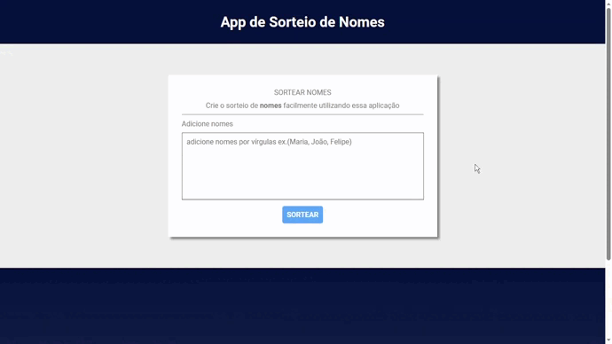

<h1 align="center">App Sorteio de Nomes</h1>

<p align="center">
  
</p>

## 📒 Descrição

Esse é um Web App feito para sortear nomes.

## 💻 Pré-requisitos
Antes de começar, verifique se você atendeu aos seguintes requisitos:

- Você tem uma máquina ```<Windows / Linux / Mac>```

## 📚 Funcionalidades

- Sortear um nome: Sorteia um nome aleatoriamente.

## 🔧 Tecnologias utilizadas

- HTML
- CSS
- JavaScript

## 🚀 Rodando o projeto

```bash
# clonar o repositório
$ git clone https://github.com/pedrodev30/app-sorteio-nomes.git

# vai entrar na pasta do projeto
$ cd app-sorteio-nomes

# abrir a pasta do projeto no seu editor
$ Abra a pasta no Visual Studio Code ou editor de sua Preferência

# Live Server é uma extensão do Vs Code que executa o arquivo no seu navegador
$ Agora abra o arquivo index.html com o live Server
```

## 🔖 Layout

Você pode visualizar o layout do projeto através [DESSE LINK](https://www.figma.com/community/file/1246217282785606432). É necessário ter conta no [Figma](https://figma.com) para acessá-lo.

## 🤝 Criador

<table>
  <tr>
    <td align="center">
      <a href="#">
        <br>
        <sub>
          <b>Pedro Henrique</b>
        </sub>
      </a>
    </td>
  </tr>
</table>